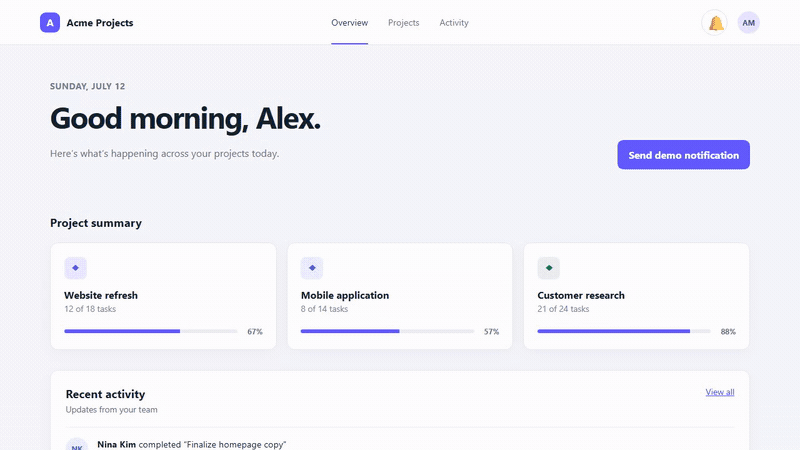
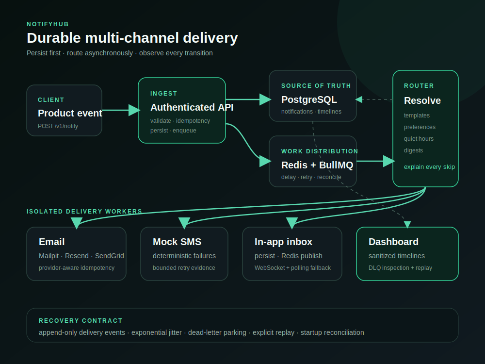

# NotifyHub

NotifyHub is a production-shaped notification service that turns one authenticated product event into durable email, SMS, and real-time in-app delivery.

[Live demo](https://notifyhub.sholaayeni.xyz/) · [Delivery dashboard](https://notifyhub.sholaayeni.xyz/dashboard) · [Measured evidence](docs/measurements.md) · [Production operations](docs/production-operations.md)



The public demo uses a fixed synthetic user and payload. It exposes no API key, recipient data, or operator capability.

## Architecture



The API authenticates and validates a request, persists it in PostgreSQL, and only then enqueues routing work. BullMQ workers resolve templates, preferences, quiet hours, and digest rules before delivering through isolated channel processes. PostgreSQL remains the authoritative record; Redis supplies queues and real-time fan-out.

## Reliability model

- **Persist first:** accepted notifications exist in PostgreSQL before background routing begins.
- **Idempotent ingestion:** a repeated `idempotencyKey` returns the original notification instead of creating another logical send.
- **Bounded recovery:** transient provider failures retry with exponential jitter; permanent or exhausted work is parked in the dead-letter queue for explicit replay.
- **Observable transitions:** each delivery records an append-only timeline from queued work through processing, retries, and its terminal result.
- **Restart safety:** reconciliation restores persisted work after process interruption, and the reliability gate kills an active worker mid-batch to prove convergence.
- **Honest at-least-once semantics:** a provider may accept a message immediately before a worker dies and records success. Provider idempotency reduces this residual duplicate window, but NotifyHub does not claim impossible end-to-end exactly-once delivery.

## Controlled evidence

An isolated 10,000-notification run accepted every request with zero HTTP failures, sustained **199.96 notifications/second** at **p95 62.51 ms**, and converged with no non-terminal queue work. The end-to-end pipeline, including the one-minute digest window, sustained 1,328.99 notifications/minute.

These are controlled synthetic results from one 4-vCPU, 7.1 GiB host using Mailpit and mock SMS. They are not a production traffic claim, hosted-provider benchmark, multi-node capacity result, or SLO. See the [method, raw evidence, and limitations](docs/measurements.md).

## Quickstart

Requirements: Docker with Compose, plus Node.js 22 and npm 10.9.2 for repository commands.

1. Copy `.env.example` to `.env` and replace every secret placeholder. Keep `POSTGRES_PASSWORD` URI-safe because it is included in the application database URL.
2. Run `docker compose up --build --wait`.
3. Open the demo at <http://127.0.0.1:4100>, the dashboard at <http://127.0.0.1:4101/dashboard>, and Mailpit at <http://127.0.0.1:4125>.
4. Choose **Send demo notification**, then follow the live inbox badge, per-channel dashboard timeline, and captured email.

Compose runs PostgreSQL 18, Redis, Mailpit, the API, five isolated worker processes, the demo host, and a one-shot fixture seed from one application image. Only the demo, API, and Mailpit UI bind to host loopback; workers and stateful services remain private.

## Integrate a product event

Use a server-held API key. Never expose it in browser code.

```bash
curl --request POST http://127.0.0.1:4101/v1/notify \
  --header "Authorization: Bearer $API_KEY" \
  --header "Content-Type: application/json" \
  --data '{
    "userId": "user-123",
    "event": "project.updated",
    "payload": {"project": "Website refresh", "actor": "Nina"},
    "idempotencyKey": "project-website-refresh-update-42"
  }'
```

The endpoint returns `202` with a `notificationId`; an idempotent replay returns the same identifier with `200`. The event requires matching templates and a known user before channel delivery can occur.

Embed the packaged React inbox after issuing a short-lived user token from your own authenticated backend:

```tsx
import { NotifyHubInbox } from '@notifyhub/widget';
import '@notifyhub/widget/styles.css';

export function Header({ notifyHubToken }: { notifyHubToken: string }) {
  return <NotifyHubInbox userToken={notifyHubToken} />;
}
```

The package also exports a vanilla `mount(element, props)` adapter. See the [project overview](docs/PROJECT_OVERVIEW.md) and canonical [engineering document](docs/notifyhub-engineering-doc.md) for the complete behavior and API inventory.

## Development and verification

The root manifest is a private npm workspace and intentionally is not a registry package. [Package scripts](docs/package-scripts.md) documents every root command, workspace role, prerequisite, and execution boundary.

GitHub Actions and the VPS are the authoritative verification environments. Pull requests must pass conventions, formatting, lint, strict typecheck, builds, unit and PostgreSQL integration suites, the Compose/browser gate, backup restoration, and worker-kill reliability. A green `main` revision deploys automatically as an immutable full-SHA release and passes live acceptance before it remains active.

## Operations

Production uses full-SHA images, protected PostgreSQL/configuration backups before rollout, serialized deployment, automatic image/Compose rollback, daily backups, and seven-day data retention. Database restoration is intentionally manual so rollback cannot silently discard notifications accepted after a backup. See [deployment, rollback, backup restoration, cron, and failure recovery](docs/production-operations.md).

## Documentation

[Implementation plan](docs/IMPLEMENTATION_PLAN.md) · [Milestones](docs/MILESTONES.md) · [Progress](docs/PROGRESS.md) · [Changelog](CHANGELOG.md) · [Security](SECURITY.md) · [Contributing](CONTRIBUTING.md)

## License

MIT
